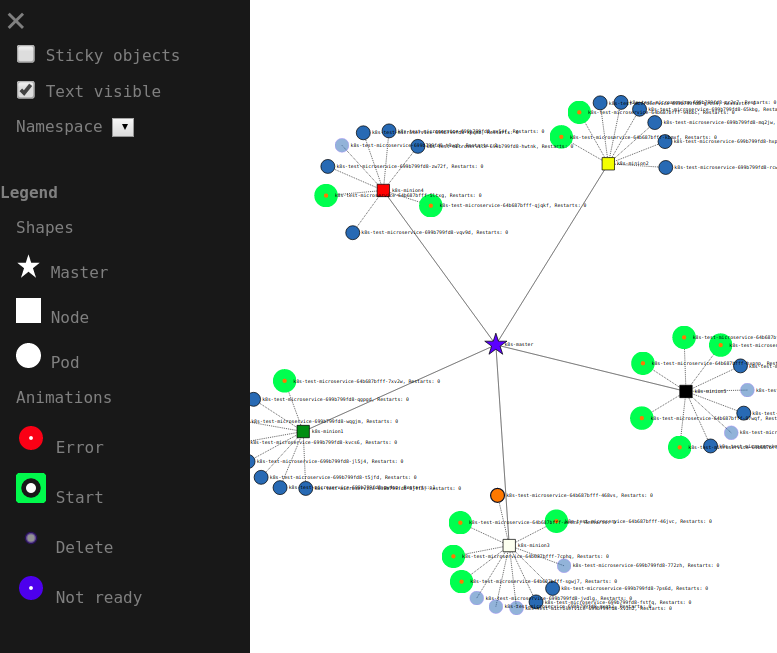

# Visualize Your Kubernetes Cluster


## Abstract
This project contains 3 parts to visualize your k8s graph.

Docker container is already available on DockerHub so you can skip
part 1. and 2. and just create the k8s deployment.

1. Node server, that polls the information from k8s api and creates
a graph using [D3](https://d3js.org/).
2. Dockerfile, that creates the container.
3. k8s yaml file, that will create a service and a deployment with two containers.
    1. kubectl started with proxy, so the node server can
    access the k8s api.
    2. Node server, that renders the graph using D3.


### Node server
Relevant files for the `node server` are `server.js`, `k8s.html`
and `package.json`.

The node server polls - by default - every second the k8s api and
extracts the relevant information to create the graph visualization
which is implemented in the html file.

The following list shows the values,
that can be configured via env variables:

* masterSize: 30
* minionSize: 30
* podSize: 15
* linkSizePodToMinion: 500
* linkSizeMinionToMaster: 800
* dummyNodes: 0 - Create dummy nodes for debugging purposes
* podsApiUrl: 'http://127.0.0.1:8001/api/v1/namespaces/default/pods'
* pollingIntervalInSeconds: 1

### Dockerfile
Yeah, this is the Dockerfile that creates the docker container with
the node server. Docker container is published at DockerHub `rilleralle/k8s-graph`

### K8s Yaml File
Yaml file creates `one service` and `one deployment - with two container`.

#### Service:
By default the service type is `NodePort`.
If you are running k8s on a cloud service like AWS or Google
you can also use a`LoadBalancer`.
[Read more about Service Types](https://kubernetes.io/docs/concepts/services-networking/service/#publishing-services---service-types).

#### Deployment:
Creates a deployment with two container.

1. `kubectl` container, that starts with proxy command so
the node server can access the k8s api to fetch the required
information to render the graph.
2. Node server container. Docker image is available on DockerHub docker pull `rilleralle/k8s-graph`
 Set env variables to configure node server. See section `Node server`

Create deployment
```
$ kubectl apply -f k8s-graph.yaml
```